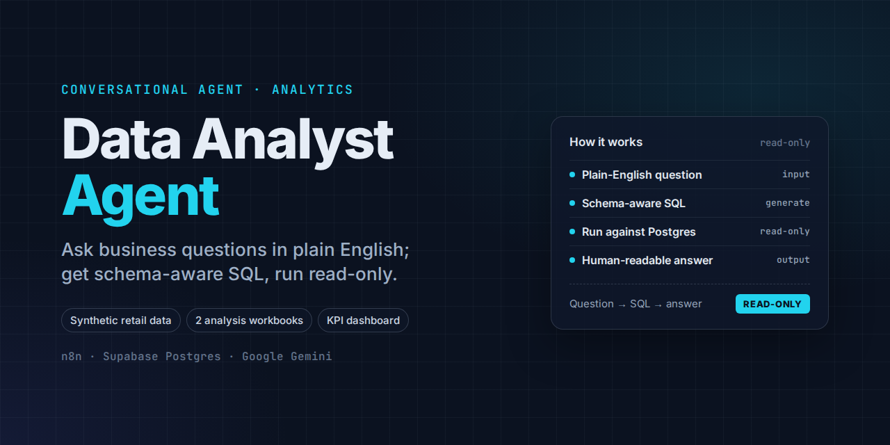
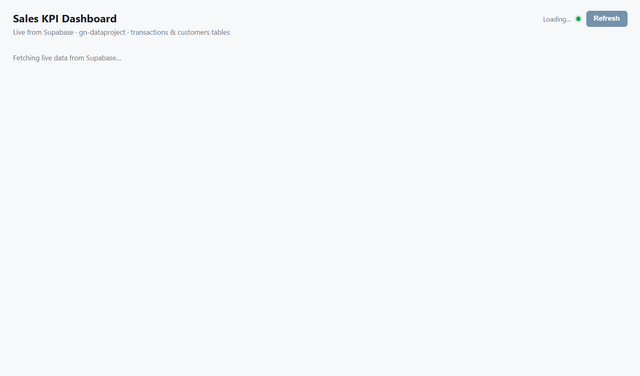

# Data Analyst Agent

A conversational data-analyst agent built on n8n, Supabase (Postgres), and Google Gemini. Ask
business questions in plain English; the agent translates them into schema-aware SQL, runs
them read-only against Postgres, and returns a human-readable answer. Includes a synthetic
retail dataset, two reproducible analysis workbooks, and a KPI dashboard built from the same
data.

**Educational / workshop project.** The dataset (`customers.csv`, `transactions.csv`) is
synthetic (Faker-generated), not real customer data.

## What's here

- `workflow.json` — the populated n8n workflow (chat trigger → AI agent → Postgres query tool),
  ready to import and adapt to your own Supabase project
- `workflow-template.json` — the same workflow stripped down to a blank starting point
- `customers.csv`, `transactions.csv` — synthetic retail dataset (1,000 customers / 3,000
  transactions) used to drive the workflow and the analyses below
- `AGENT_ANALYSIS.md` — reproducible SQL + methodology behind the two analysis workbooks
  below (top products/customers, and sales by location/channel)
- `Top_Products_Customers_Analysis.xlsx`, `Sales_by_Location_Channel_Analysis.xlsx` — the
  generated analysis workbooks
- `sales-kpi-dashboard.pdf` — a KPI dashboard summarizing the same dataset (preview below)

## How it works

1. **When chat message received** — takes a natural-language question from the user
2. **AI Agent** (Gemini) — interprets the question against the known schema and generates SQL
3. **Run SQL Query** — executes the generated SQL (read-only) against Postgres
4. **Response** — the agent turns the result set into a plain-language answer

See `workflow.json`'s embedded system prompt for the exact schema definitions and SQL
formatting rules (PostgreSQL requires double-quoted column names here, since the source
tables use mixed-case column names).

## Setup

1. Import `workflow-template.json` into n8n.
2. Point the Postgres credential at your own database, loaded with `customers.csv` /
   `transactions.csv` (or your own data using the same schema — see `AGENT_ANALYSIS.md`).
3. Add your own Google Gemini API credential.
4. Fill in the system prompt (see `workflow.json` for a complete example) with your schema.

## Limitations

Read-only queries only (no INSERT/UPDATE/DELETE), single database connection, and
conversation memory is ephemeral (session-scoped). See `AGENT_ANALYSIS.md` for the
production-hardening checklist (query validation, rate limiting, row-level security, etc.)
if adapting this beyond a workshop exercise.
